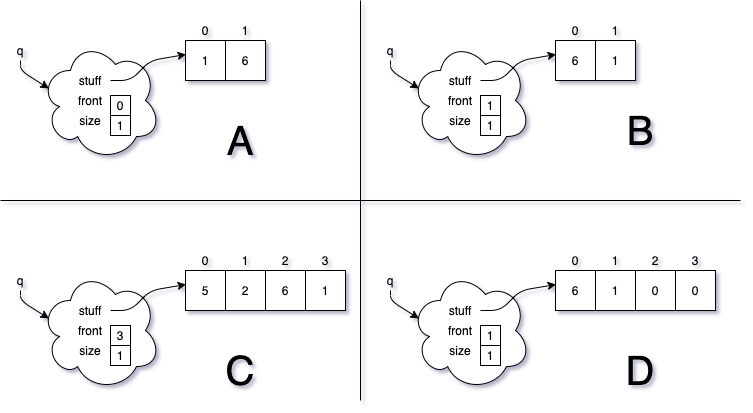
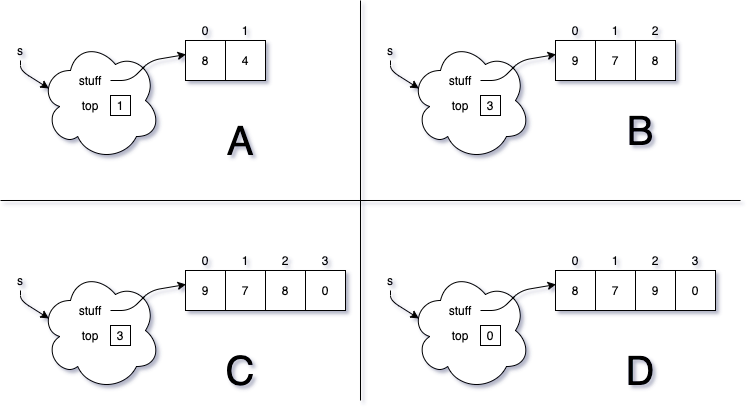
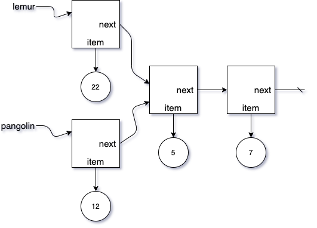
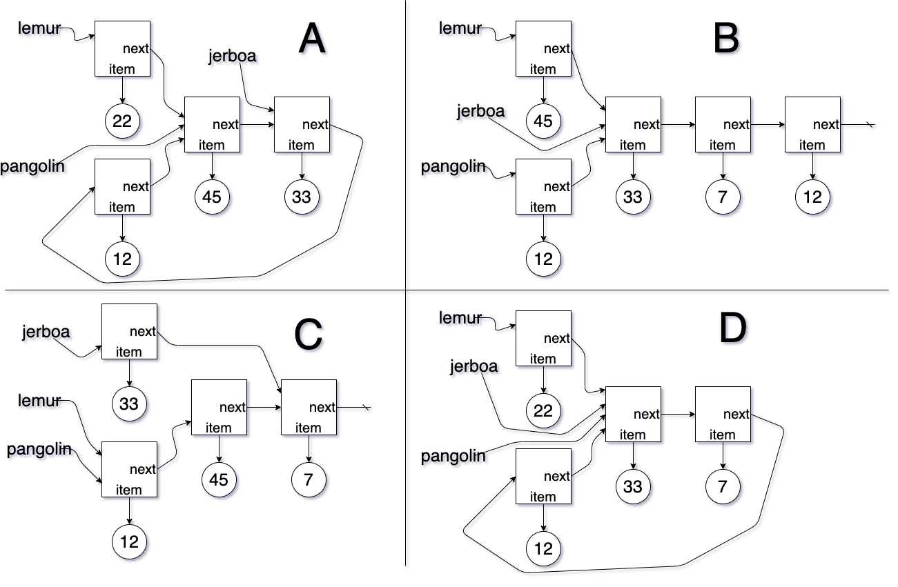

In case the images don't load on the exam, here they are.

# ArrayQueue Starting Diagram

{: .img-fluid}

# ArrayQueue Choices Diagram

{: .img-fluid}

# ArrayStack Starting Diagram

{: .img-fluid}

# ArrayStack Choices Diagram

{: .img-fluid}

# ListNode Starting Diagram

{: .img-fluid}

# ListNode Choices Diagram

{: .img-fluid}
