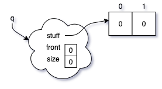
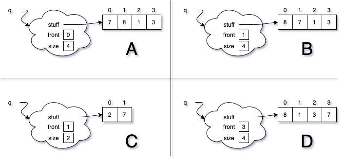

# ArrayQueue

{: .img-fluid}

Here is an initial memory diagram of an ArrayQueue. Choose the final state from the options below after executing the code provided. Use the circular definition of the ArrayQueue we discussed in class and implemented in lab.

    q.add(2);
    q.remove();
    q.add(7);
    q.add(8);  
    q.add(1);
    q.add(3);

{: .img-fluid}

Write a paragraph justifying your choice.
