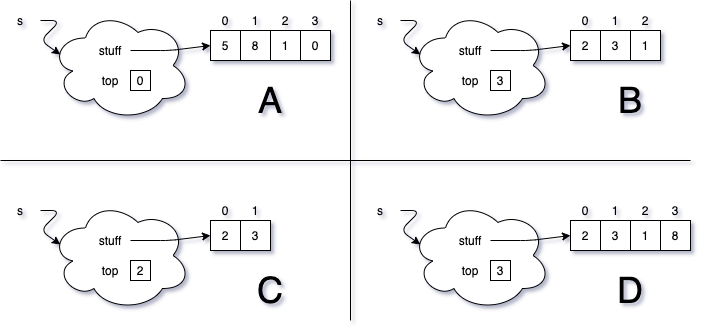

# ArrayStack

{: .img-fluid}

Here is an initial memory diagram of an ArrayStack. Choose the final state from the options below after executing the code provided. Use the definition of the ArrayStack we discussed in class and implemented in lab.

    s.push(2);
    s.push(3);
    s.push(5);
    s.push(8);
    s.pop();
    s.pop();
    s.push(1);

{: .img-fluid}

Write a paragraph justifying your choice.
