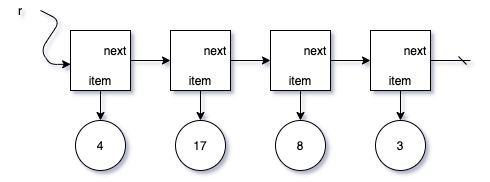
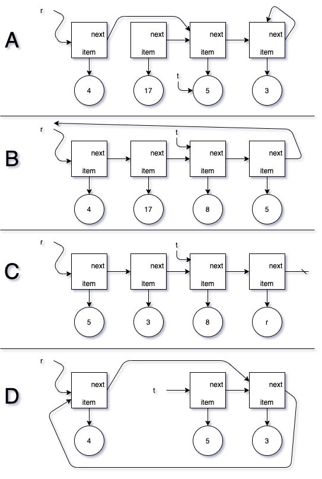

# ListNode

{: .img-fluid}

Choose the memory diagram below to show the result of executing the following lines of Java code.

    t = r.getNext().getNext();
    r.setNext(t.getNext());
    t.setItem(5);
    t.getNext().setNext(r);

{: .img-fluid}

Come to office hours ready to explain your choice.
