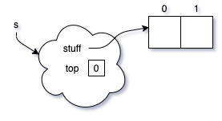
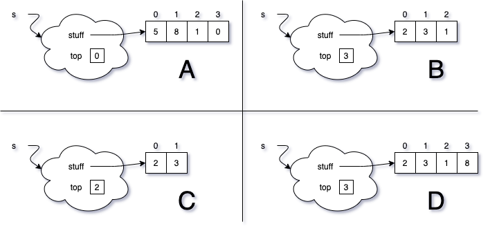
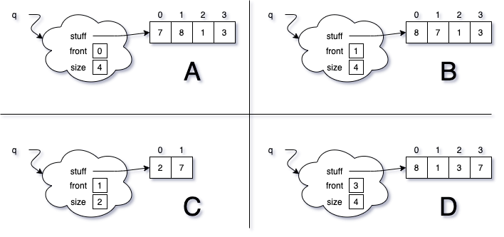

# ArrayStack

{: .img-fluid}

Here is an initial memory diagram of an ArrayStack. Choose the final state from the options below after executing the code provided. Use the definition of the ArrayStack we discussed in class and implemented in lab.

    s.push(2);
    s.push(3);
    s.push(5);
    s.push(8);
    s.pop();
    s.pop();
    s.push(1);

{: .img-fluid}

Write a paragraph justifying your choice.

# ArrayQueue

{: .img-fluid}

Here is an initial memory diagram of an ArrayQueue. Choose the final state from the options below after executing the code provided. Use the circular definition of the ArrayQueue we discussed in class and implemented in lab.

    q.add(2);
    q.remove();
    q.add(7);
    q.add(8);  
    q.add(1);
    q.add(3);

{: .img-fluid}

Write a paragraph justifying your choice.

# ListNode

{: .img-fluid}

Choose the memory diagram below to show the result of executing the following lines of Java code.

    t = r.getNext().getNext();
    r.setNext(t.getNext());
    t.setItem(5);
    t.getNext().setNext(r);

{: .img-fluid}

Write a paragraph justifying your choice.
