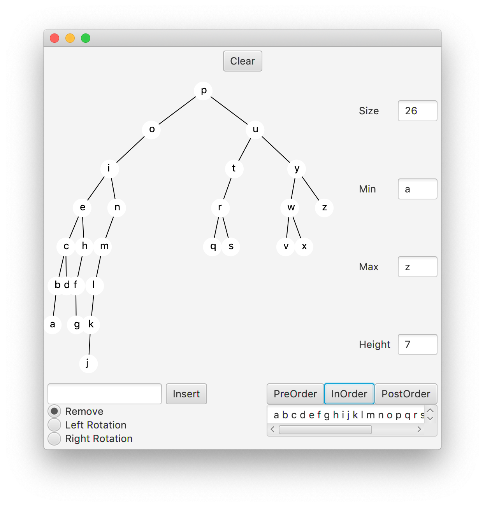

## Overview

In this lab, we will implement a Binary Search Tree and visualize the
processes of insertion, deletion, and rotation.

## Materials

-   IntelliJ
-   Lab partner

## Setup

1.  Download the [skeleton](../code/151bst.zip) for this
    project.
2.  Unpack the code into a new IntelliJ Java project.

## Description

We can efficiently store information with arrays and linked lists, but
determining if an element is present could take a linear search through
each element if the data is not sorted. At best, sorting will take *O(n
log n)*, and so we explore an alternative here which incorporates the
idea of binary search into a linked structure of nodes.



{: .img-fluid}

## `Optional` vs `null`

One way to implement a `TreeNode` in Java is to use `null` for the `left`
and `right` children when these children are empty. However, this opens up
the possibility for a `NullPointerException` if we code incorrectly, and
we won't know if the exception is because of this or some other
unexpected `null` in our algorithm.

In this lab, we will use a special class in Java called `Optional`. This
class can be used in lieu of `null`, so you know exactly what error you are
getting and why. We wrap all of our `TreeNode` objects in an
`Optional` object. So, instead of saying `left == null`, we would
ask 'left.isPresent()'. If `left` exists, then we can get the `TreeNode` by
saying `left.get()`.



Methods that remain to be implemented in the `TreeNode` class have been
marked with TODO for easy identification.

## Step 1: `insert()` and `contains()`

Use recursion to complete the `insert()` and `contains()` methods in the `TreeNode`
class. Both of them will need to use the result of `value.compareTo(this.value)` method
to determine if the parameter is less than, equal to, or greater than the value
at the current `TreeNode`.

The test case `BinarySearchTreeTester.test1()` should pass if
your solutions are correct.

## Step 2: Tree Statistics and Visualization

Complete the `height()`, `size()`, `getMin()`, and `getMax()` methods in
the `TreeNode` class.

Then run `BinaryTreeApp`. As you insert nodes into your
tree, you should see the statistics updated on the right. Make sure the
values are correct by experimenting with different tree structures.

## Step 3: Traversals

Complete the `preOrder()`, `postOrder()`, and `inOrder()` methods in the
`TreeNode` class. The `op` parameter is a `Consumer` object that performs
the `op.accept(value)` operation on the current value either before, after,
or in-between using recursion to traverse the children.

These methods should pass their unit tests, and also you
can test them in `BinaryTreeApp`.

## Step 4: Deletion

Implement the `remove()` method. Note that it does not return the
removed node; it returns the node upon which it was invoked, and
rebuilds the tree as it exits from its recursive calls. Follow the
comments carefully.

It should pass its unit tests and again is testable
on the GUI, by clicking on nodes you wish to remove.

## What to Hand In

Submit `TreeNode.java` as well as your evaluation document.

## Grading

* To earn a 10, complete Step 1
* To earn a 13, do the above and Step 2
* To earn a 16, do the above and Step 3
* To earn a 20, do the above and Step 4
