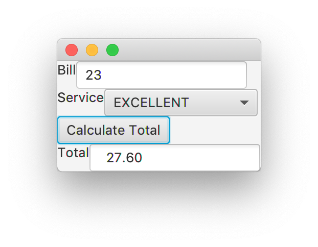

## Overview

In this lab, we learn how to create GUI components for an application
using JavaFX.

## Materials

-   IntelliJ
-   Lab partner
-   [Scene Builder](http://gluonhq.com/products/scene-builder/)

## Description

To create an application using JavaFX, we will need a number of pieces.
There will often be a Model, View, Controller, and Application. For our
first application we will create a tip calculator.

## Step 1 - Tip Application Setup

-   Create a new Java project named "tip".
-   Create a new package within the project also called "tip".
-   Create a new class called `Tip`. This will hold the overview code
    for the Application. Then enter the following code:

<!-- -->

    package tip;

    import javafx.application.Application;
    import javafx.stage.Stage;
    import javafx.fxml.FXMLLoader;
    import javafx.scene.Scene;
    import javafx.scene.layout.BorderPane;

    public class Tip extends Application {
      @Override
      public void start(Stage primaryStage) {
        try {
          FXMLLoader loader = new FXMLLoader();
          BorderPane root =
            (BorderPane)loader.load(getClass().getResource("TipGUI.fxml").openStream());
          primaryStage.setScene(new Scene(root));
          primaryStage.show();
          root.requestFocus();
        } catch (Exception e) {
          e.printStackTrace();
          System.exit(1);
        }
      }
      public static void main(String[] args) {
        launch(args);
      }
    }

## Step 2 - Tip FXML View

Now, we need to add in the View, describing how the GUI will look on the
screen and the components available to the program.

-   Select File → New → New FXML Document
-   For "Name" enter `TipGUI`
-   Then click "Finish".

Editing the raw XML document can be extremely tedious. Luckily, there is
a extension called SceneBuilder that you can use to graphically add
components.

-   Right-click on the TipGUI.fxml file, and select "Open in SceneBuilder".
-   Right-click and delete the default AnchorPane layout.
-   Go to Containers and drag a BorderPane into the center.
    -   Select the BorderPane and pick the Layout menu.
    -   Change Pref Width and Pref Height to USE\_COMPUTED\_SIZE.
-   Drag a VBox into "insert CENTER".
    -   Select the VBox and pick the Layout menu.
    -   Change Pref Width and Pref Height to USE\_COMPUTED\_SIZE.
-   Drag an HBox into the VBox.
    -   Go to Controls and drag a Label and a TextField into the HBox.
    -   Select the HBox and pick the Layout menu.
    -   Change Pref Width and Pref Height to USE\_COMPUTED\_SIZE.
    -   Select the Label and pick Properties. Then change the text to
        "Bill".
-   Add another HBox to the VBox.
    -   Add a Label and a ChoiceBox.
    -   Fix the layout as described above.
    -   Then change the Label to "Service".
-   Add another HBox to the VBox.
    -   Add a Label and a TextField.
    -   Fix the layout as described above.
    -   Then change the Label to "Total".
    -   Select the TextField and pick Properties.
    -   Uncheck the Editable box.

Your GUI should look like this

{: .img-fluid}

Now, save the GUI and close SceneBuilder.

## Step 3 - Service Enum

We would like to tip based on three perceived levels of service. This is
an excellent opportunity for an Enum. Create a new Enum called
`Service`. Add the following code:

    package tip;

    public enum Service {
      POOR {
        @Override
        public double tip() {
          return 0.1;
        }
      }, GOOD {
        @Override
        public double tip() {
          return 0.15;
        }
      }, EXCELLENT {
        @Override
        public double tip() {
          return 0.2;
        }
      };

      abstract public double tip();

      public double computeTotal(double bill) {
        return (1.0 + tip()) * bill;
      }
    }

## Step 4 - TipController

Now create a new class called `TipController`. This gives us a way to
respond to the clicks and keys pressed when the program is running.
Notice the calculate method, which will compute the tip amount based on
the selected options in the app.

Add the following code:

    package tip;

    import javafx.fxml.FXML;
    import javafx.scene.control.ChoiceBox;
    import javafx.scene.control.TextField;

    public class TipController {

      @FXML
      private TextField bill;

      @FXML
      private ChoiceBox<Service> tips;

      @FXML
      private TextField total;

      @FXML
      public void initialize() {
        bill.setEditable(true);
        total.setEditable(false);
        for (Service s: Service.values()) {
          tips.getItems().add(s);
        }
        tips.getSelectionModel().select(Service.GOOD);
      }

      @FXML
      public void calculate() {
        double billEntered = Double.parseDouble(bill.getText());
        Service level = tips.getSelectionModel().getSelectedItem();
        double totalAmount = level.computeTotal(billEntered);
        total.setText(String.format("%7.2f", totalAmount));
      }
    }

## Step 5 - Tip Calculation

Finally, we need a button we can click that will calculate the tip
according to our choices. In this step we are setting up the wiring
between the View and Controller portions of the app. Open up TipGUI.fxml
again in SceneBuilder.

-   Add a Button to the VBox between the second and third HBox elements.
-   Change the text to "Calculate Total".

On the left side, go to Document → Controller. Select
`tip.TipController` in the drop-down menu.

-   Select the top TextField.
    -   Go to the Code menu on the right.
    -   For fx:id, select "bill".
-   Select the other TextField. For its fx:id, select "total".
-   Select the ChoiceBox. For its fx:id, select "tips".
-   Select the Button. For "On Action", select "calculate".

Save the GUI in SceneBuilder and close SceneBuilder.

### Step 5.1 module-info.java

One final piece is needed to get the program ready to run.
In the src folder, create a file called `module-info.java`. Add this code into that file.

    module tip {
        requires javafx.fxml;
        requires javafx.controls;
        exports tip;
        opens tip;
    }

Your GUI should look like this

{: .img-fluid}

Run Tip and test the program.

## Step 6 - Tip Extensions

Now, edit the program and interface as follows:

1.  Add a GREAT category to `Service`, tipped at 18%.
2.  Add a way for the user to enter the number of people dining. Then,
    add a field to display the amount of money each individual
    separately owes.
3.  Read about [spacing and padding](https://www.vojtechruzicka.com/javafx-layouts-basic/) and
    use them to improve the appearance of your GUI.

## Step 7 - Animation

1.  Download the [skeleton](../code/animationdemo.zip) for the next two steps.
2.  Unpack the code into a new IntelliJ Java project.

In this demo, you will find a `Ball` class, the Model portion of our application,
that controls a bouncing ball in a javafx `Pane`.
Our FXML view consists of a `BorderPane` with a `Pane` in the center.
The `DemoController` class
coordinates between the events collected in the `Pane` view and the `Ball` model.

Run the GUI to see 5 balls drawn and move on the pane with random directions and
speeds. When you select a ball, it will change color to red and stop moving. You can
drag the ball to a new location. When you drop the ball, it will turn blue and
start moving again.

## Step 8 - Animation Extensions

Now you will make additions to this demo, to solidify your understanding from
the earlier steps and learn the particulars of animation.

### Step 8.1

Add two Buttons to the GUI that will Start and Stop the AnimationTimer. You will
need to add two functions to the DemoController with @FXML annotations, and map
the buttons to these functions. These functions should call `clock.start()` and
`clock.stop()` respectively.

### Step 8.2

Allow the `Pane` in DemoController to accept MousePressed events. When the
pane is pressed, call the `makeCircle` method. You will notice that new balls
appear! However, they also appear when you try to pick up and move the
other balls. To prevent this, both of the MousePressed callback methods will need
to consume the events they handle, through calling `event.consume()`.

### Step 8.3

Augment the Movement private class to slowly grow and shrink the
balls. First, you should add a `setRadius(double radius)` method to the `Ball`
class that sets the radius. Then, add in two fields to the private `Movement` class,
one for the current `radius`, initialized at 25, and one called `dr` for the rate of change,
initialized at 0.1. In the for loop, set the radius of each `Ball` b to the current
radius. Following the for loop, add the following lines:

<!-- -->

    radius += dr;
    if (radius > 40 || radius < 25) {
        dr *= -1;
    }

### Step 8.4

Make one more alteration to the AnimationDemo project, of your choice.

## What to Hand In

Create a zip file of your Tip project. Submit the zip file via Teams. (To
create the zip file, select File -\> Export to Zipfile..)

Create a zip file of your edited AnimationDemo project. Submit the zip via Teams.

## Grading

* To earn a 7, complete Steps 1-4
* To earn a 10, do the above and Step 5
* To earn a 14, do the above and Step 6
* To earn a 16, do the above and Step 7
* To earn a 20, do the above and Step 8
