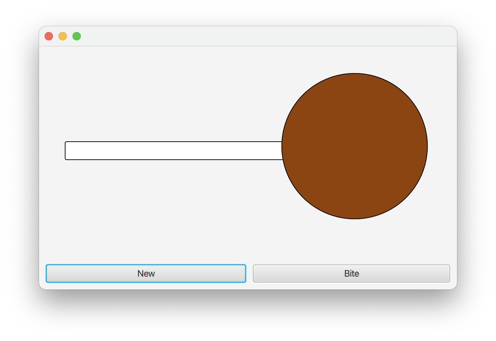

## Overview

In this lab, we learn how to create GUI components for applications
using JavaFX.

## Materials

-   IntelliJ
-   Lab partner
-   [Scene Builder](http://gluonhq.com/products/scene-builder/)

## Description

To create an application using JavaFX, we will need a number of pieces.
There will often be a Model, View, Controller, and Application. Through these
three applications, you will see why all these are separated and how it is all connected.

## Step 1 - Tip Application

For our first application we will create a tip calculator. We will include all of the details with multiple places where you copy and paste to create your application.

### Step 1.1 - Setup

-   Create a new Java project named "tip".
-   Create a new package within the project also called "tip".
-   Create a new class called `Tip`. This will hold the overview code
    for the Application. Then enter the following code:

<!-- -->

    package tip;

    import javafx.application.Application;
    import javafx.stage.Stage;
    import javafx.fxml.FXMLLoader;
    import javafx.scene.Scene;
    import javafx.scene.layout.BorderPane;

    public class Tip extends Application {
      @Override
      public void start(Stage primaryStage) {
        try {
          FXMLLoader loader = new FXMLLoader();
          BorderPane root =
            (BorderPane)loader.load(getClass().getResource("TipGUI.fxml").openStream());
          primaryStage.setScene(new Scene(root));
          primaryStage.show();
          root.requestFocus();
        } catch (Exception e) {
          e.printStackTrace();
          System.exit(1);
        }
      }
      public static void main(String[] args) {
        launch(args);
      }
    }

### Step 1.2 - Tip FXML View

Now, we need to add in the View, describing how the GUI will look on the
screen and the components available to the program.

-   Select File → New → New FXML File
-   For "Name" enter `TipGUI`
-   Then click "Finish".

Editing the raw XML document can be extremely tedious. Luckily, there is
a extension called SceneBuilder that you can use to graphically add
components.

-   Right-click on the `TipGUI.fxml` file, and select "Open in SceneBuilder".
    - If "Open in SceneBuilder" is not present, select "Open in Associated 
      Application" and navigate to where SceneBuilder is installed on your machine.
-   In the left-hand column under Document → Hierarchy, right-click and delete the 
    default `AnchorPane` layout.
-   Go to Containers and drag a `BorderPane` into the center.
    -   Select the `BorderPane` and pick the Layout menu in the right-hand column.
    -   Change Pref Width and Pref Height to USE\_COMPUTED\_SIZE.
-   Drag a `VBox` from Containers into "insert CENTER".
    -   Select the `VBox` and pick the Layout menu.
    -   Change Pref Width and Pref Height to USE\_COMPUTED\_SIZE.
-   Drag an `HBox` into the `VBox`.
    -   Go to Controls and drag a `Label` and a `TextField` into the `HBox`.
    -   Select the `HBox` and pick the Layout menu.
    -   Change Pref Width and Pref Height to USE\_COMPUTED\_SIZE.
    -   Select the `Label` and pick Properties. Then change the text to
        "Bill".
-   Add another `HBox` to the `VBox`.
    -   Add a `Label` and a `ChoiceBox`.
    -   Fix the layout as described above.
    -   Then change the `Label` to "Service".
-   Add another `HBox` to the `VBox`.
    -   Add a `Label` and a `TextField`.
    -   Fix the layout as described above.
    -   Then change the `Label` to "Total".
    -   Select the `TextField` and pick Properties.
    -   Uncheck the Editable box.

Your GUI should look like this

{: .img-fluid}

Now, save the GUI and close SceneBuilder.

### Step 1.3 - Service Enum

We would like to tip based on three perceived levels of service. This is
an excellent opportunity for an Enum. Create a new Enum called
`Service` within the `tip` package. Add the following code:

    package tip;

    public enum Service {
      POOR {
        @Override
        public double tip() {
          return 0.1;
        }
      }, GOOD {
        @Override
        public double tip() {
          return 0.15;
        }
      }, EXCELLENT {
        @Override
        public double tip() {
          return 0.2;
        }
      };

      abstract public double tip();

      public double computeTotal(double bill) {
        return (1.0 + tip()) * bill;
      }
    }

### Step 1.4 - TipController

Now create a new class called `TipController`. This gives us a way to
respond to the clicks and keys pressed when the program is running.

The `initialize` method in a Controller is similar to a constructor in other classes. It will be the place where objects are created and initial state is set up.

Also notice the `calculate` method, which will compute the tip amount based on
the selected options in the app.

Add the following code:

    package tip;

    import javafx.fxml.FXML;
    import javafx.scene.control.ChoiceBox;
    import javafx.scene.control.TextField;

    public class TipController {

      @FXML
      private TextField bill;

      @FXML
      private ChoiceBox<Service> tips;

      @FXML
      private TextField total;

      @FXML
      public void initialize() {
        bill.setEditable(true);
        total.setEditable(false);
        for (Service s: Service.values()) {
          tips.getItems().add(s);
        }
        tips.getSelectionModel().select(Service.GOOD);
      }

      @FXML
      public void calculate() {
        double billEntered = Double.parseDouble(bill.getText());
        Service level = tips.getSelectionModel().getSelectedItem();
        double totalAmount = level.computeTotal(billEntered);
        total.setText(String.format("%7.2f", totalAmount));
      }
    }

### Step 1.5 - Tip Calculation

Finally, we need a button we can click that will calculate the tip
according to our choices. In this step we are setting up the wiring
between the View and Controller portions of the app. Open up `TipGUI.fxml`
again in SceneBuilder.

-   Add a `Button` to the `VBox` between the second and third `HBox` elements.
-   Change the text to "Calculate Total".

On the left side, go to Document → Controller. Select
`tip.TipController` in the drop-down menu.

-   Select the top `TextField`.
    -   Go to the Code menu on the right.
    -   For fx:id, select "bill".
-   Select the other `TextField`. For its fx:id, select "total".
-   Select the `ChoiceBox`. For its fx:id, select "tips".
-   Select the `Button`. For "On Action", select "calculate".

Save the GUI in SceneBuilder and close SceneBuilder.

Your GUI should look like this

{: .img-fluid}

Run Tip and test the program.

### Step 1.6 - Tip Extensions

Now, edit the program and interface as follows:

1.  Add a GREAT category to `Service`, tipped at 18%.
2.  Add a way for the user to enter the number of people dining. Then, add a field to display the amount of money each individual separately owes.
3.  Read about [spacing and padding](https://www.vojtechruzicka.com/javafx-layouts-basic/) and use them in SceneBuilder to improve the appearance of your GUI.

## Step 2 - Button Pressing

Now, start from scratch and use the information above to test out your
new JavaFX skills. Create a new project using JavaFX to make a program that records how many times a button has been clicked.

### Step 2.1 - Application

Create a new Java project and package for your application. Copy/paste the template Application code above and alter it for your new project.

### Step 2.2 - GUI View

Create a FXML document. In your GUI, your project should include at a minimum a `BorderPane` with a `Button` and a `Label`, created through `SceneBuilder`. You might need some `HBox` or `VBox` pieces to organize your GUI.



You GUI could look like this for example:

{: .img-fluid}

### Step 2.3 - Controller

Create a Controller class. The controller should

* link up your GUI objects through fields.
* include an additional `int` field to track the number of times the button has been pressed. **This value should not be parsed and updated purely by using the GUI `Label`**.
* attach a method to the `Button` which increments the counter field, and then writes this number to the label on the screen.

### Step 2.4 - Testing

Run the GUI and test your program.

## Step 3 - TootsiePop

The previous two apps introduced the Controller, View, and Application, but noticeably there was no *Model*. For this third project, we will build an application around our `TootsiePop` class from earlier in the semester.

### Step 3.1 - Application

Create a new Java project and package for your application. Copy/paste the template Application code above and alter it for your new project.

### Step 3.2 - GUI View

Create a FXML document. In your GUI, use `SceneBuilder` to include at a minimum a `BorderPane` with two `Button`s and a visual representation of a TootsiePop created with a
[Circle](https://openjfx.io/javadoc/17/javafx.graphics/javafx/scene/shape/Circle.html) and a
[Rectangle](https://openjfx.io/javadoc/17/javafx.graphics/javafx/scene/shape/Rectangle.html). You might need some `HBox` or `VBox` pieces to organize your GUI, and an `AnchorPane` could be helpful for designing the TootsiePop visuals.

The two `Buttons` should be labeled `New` and `Bite`.



You GUI could look like this for example:

{: .img-fluid}

### Step 3.3 - Flavor Enum

Create a `Flavor` Enum. You should define at least five flavors, each of which has a different [Color](https://openjfx.io/javadoc/17/javafx.graphics/javafx/scene/paint/Color.html) accessible through a `getColor()` method.

### Step 3.4 - TootsiePop Model

Revise your `TootsiePop` code from HW1 in the following ways to prepare it for use in the GUI application.

* the constructor should bring in a `Flavor` instead of a `String`.
* add a `getLicks` method to return the number of licks.
* add a `getFlavor` method to return the `Flavor` of the TootsiePop.

The remaining methods should stay the same.

### Step 3.5 - Controller

Create a Controller class. The controller should

* link up your GUI objects through fields.
* include a field for a `TootsiePop` and create a new `TootsiePop` in the `initialize` method with a random flavor and a size of 40.
* attach an `onTap()` method to the `Circle` which call lick on your `TootsiePop`.
* attach an `onNew()` method to one `Button` which create a new `TootsiePop` with a random flavor and a size of 40.
* attach an `onBite()` method to one `Button` which call bite on your `TootsiePop`.
* write an `updateView()` method. In this method, the radius of the `Circle` should be set to be proportional to the number of licks left in your TootsiePop, and the `Circle` should use `setFill` to update its `Color`. You should call this method as the last command in each of the three previous interaction methods.

### Step 3.5 - Testing

Run the GUI and test your program.

## What to Hand In

Create a zip file of your Tip project. Submit the zip file via Teams. (To
create the zip file, select File -\> Export to Zipfile..)

Create a zip file of your Button project. Submit the zip via Teams.

Create a zip file of your TootsiePop project. Submit the zip via Teams.

## Grading

* To **Partially Complete** this lab, complete Steps 1 and 2
* To **Complete** this lab, do the above and Step 3
