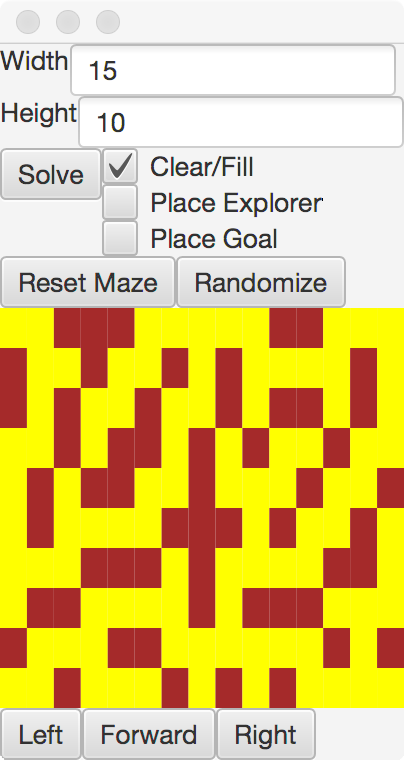
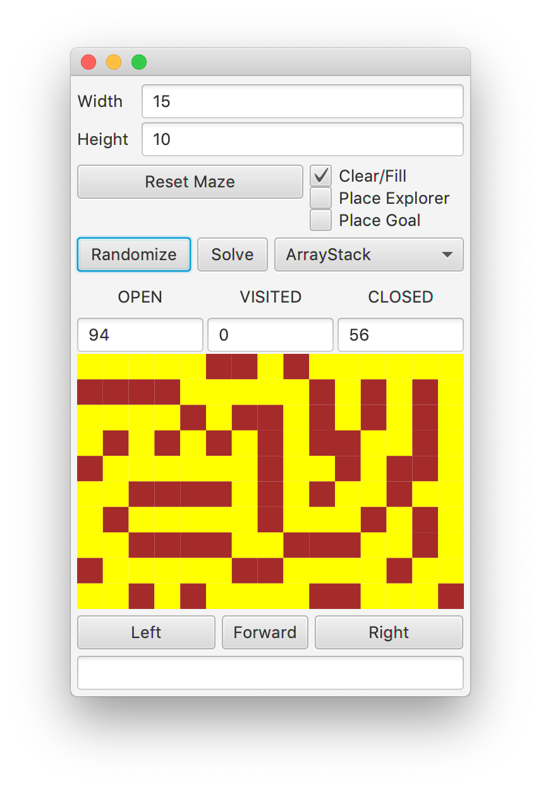
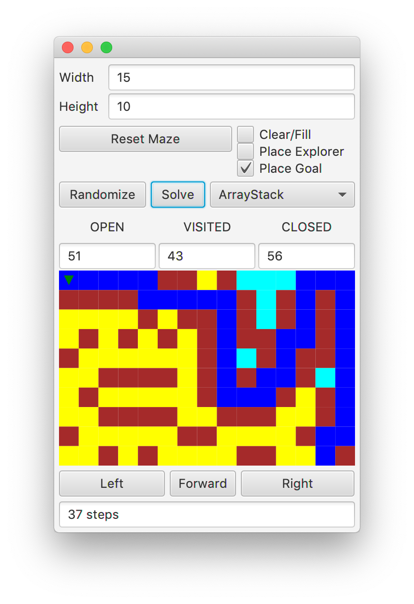

## Overview

In this lab, we will implement generic version of the Stack
data type within the context of searching a maze.

## Materials

-   IntelliJ
-   Lab partner

## Setup

1.  Download the [skeleton](../code/maze151dfs.zip) for this project.
2.  Extract the code, then open the maze151dfs folder in IntelliJ to start a new project.

## Description

In this lab, we will explore searching a maze for a goal using a stack to
organize our potential Trails. The stack allows us to search in a
depth-first search manner. In other words, we can explore down a trail
as far as possible, and backtrack if we reached a dead end in our
journey, because we search the youngest potential trail next.

In this lab, you will create the necessary data structures to search a
maze in this depth-first search manner.

To start, run the code in `MazeApp`. You
should see the GUI layout here.

{: .img-fluid}

There are a few new pieces to this GUI. First, you will see a
choice for either `ArrayStack` or `ListStack`.
You will find the starter code for these included in the
`maze.searchers` directory.

Second, you will notice that there are statistics in the middle portion
of the GUI, recording the number of `OPEN`, `CLOSED`, and `VISITED` squares.

Third, there is a box at the bottom, to report errors when
things go wrong with the underlying implementations. It will also report
the number of steps taken when a solution trail is found through
searching.



## Step 1 - ArrayStack\<E\>

Our first task is to implement a generic Stack class that can be used in many
pieces of the code, for generating and then solving mazes.

Write a class called `ArrayStack<E>`. This will need to implement the
`Stack<E>` interface. The fields and constructor are provided for you.



### Step 1.1 - `public void push(E item)`

If there is no more room in the `stuff` array, you will need to **resize**.

* Create a new array twice as big as `stuff`.
* Copy over each item into the new array.
* Redirect the `stuff` reference to the new array.

Now, you can always add the new item to `top` spot in the `stuff` array,
and increment the `top`.

### Step 1.2 - `public E pop()`

Call the `emptyCheck` method. This will throw an `IllegalStateException`
if the stack is empty.

Decrement the value of `top`, and then return the item in the `top` spot
of the `stuff` array.

### Step 1.3 - `public E peek()`

Call the `emptyCheck` method. This will throw an `IllegalStateException`
if the stack is empty.

Return the item in the `top - 1` spot of the `stuff` array.

### Step 1.4 - `public int size()`

Return the number of items in `stuff`.

### Step 1.5 - `public String toString()`

Return a `String` representing the elements in the stack separated
by spaces. For example, a stack of integers with 3 on top of 2 on top of 1
should return "1 2 3". The oldest element in the stack should be the first
in the string.

### Step 1.6 - Testing

Run the `ArrayStackTest` suite, and ensure your above methods are passing
these tests.

## Step 2 - ListStack\<E\>

To implement the generic version of a Stack with nodes, your
first task is to implement the generic `ListNode` class.

### Step 2.1 - ListNode

You will first need to create a file called `ListNode.java` that
implements the Node class we discussed. It should have an `E value` and
a `ListNode next` reference as private components, along with public get and set
methods for the value and next fields. You should make two constructors.
The first brings in and stores only an `E value`, and leaves the `ListNode next` as `null`.
The second brings in both an `E value`, and a `ListNode next`, storing both.



### Step 2.2 - Implementation

Write a class called `ListStack<E>`. This will need to implement the
`Stack<E>` interface, and have at least a `ListNode<E>` called `top` as a
field.

Note that there is an additional method to implement. For ListNode
implementations, the `capacity` method should return the size.

### Step 2.4 - `public void push(E item)`

Create a new `ListNode` that stores the `item`, and has the current `top`
as its `next`.

Redirect `top` to reference this new `ListNode`.

### Step 2.5 - `public E pop()`

Call the `emptyCheck` method. This will throw an `IllegalStateException`
if the stack is empty.

Save the value stored in `top`, and redirect `top` to point to the `next` `ListNode`.

Return the value you stored.

### Step 2.6 - `public E peek()`

Call the `emptyCheck` method. This will throw an `IllegalStateException`
if the stack is empty.

Return the value stored in the `top` `ListNode`.

### Step 2.7 - `public int size()`

If `top` is `null`, return 0. Otherwise,
return the number of `ListNode` that are chained from the `top` node.

### Step 2.8 - `public String toString()`

Return a `String` representing the elements in the stack separated
by spaces. For example, a stack of integers with 3 on top of 2 on top of 1
should return "1 2 3". The oldest element in the stack should be the first
in the string.

### Step 2.9 - Testing

Run the `ListStackTest` suite, and ensure your above methods are passing
these tests.

### Step 3 - Creating Random Mazes

Uncomment code labeled for this portion in

-   MazeController

First, you will be creating random mazes by implementing the
`tunnelRandomly` function in the `Puzzle` class.

### Step 3.1 - `public void tunnelRandomly()`

Create an `ArrayStack` of `Positions`, and push (0,0) onto the stack.

While the stack still has Positions:

-   Pop the top `Position` from the stack.
-   Try to `clear` this `Position`.
-   If the clear was successful (returned `true`):
    -   Clear this `Position`
    -   Add the `CLOSED` neighbors of this `Position` to the stack in a **random** order.



### Step 4.3 - GUI

Run the GUI to interact with your code and make random mazes. You should
see mazes similar to the image below.

{: .img-fluid}

### Step 4 - Solving Mazes

Uncomment code labeled for this portion in

-   Trail
-   PuzzleTest
-   MazeController

A `Trail` is another recursive data structure, similar to a `ListNode`. The
two fields of a `Trail` are a `Position`, denoting the `end` of the trail, and
a link to another `Trail` called `prev`, which is a record of how you
arrived at the current `Trail`. For the first step of a `Trail`, the `prev` is
left as `null`.

In this step, you will use `Trails` to write an algorithm in the
`Puzzle` class that solves a maze using depth-first search (DFS).

### Step 4.1 - `public Trail solve(Stack<Trail> solver)`

If there is no `Explorer` in the maze or no goal in the maze, then return
`null`.

Otherwise, push a new `Trail` starting at the `Explorer`'s
position onto the `solver` stack.

While the stack still has potential `Trails`:

-   Pop the top `Trail` from the stack.
-   If the `Trail` end is the goal `Position`, return this `Trail`
-   If the `Cell` in the `Maze` at the `Trail` end is `OPEN`
    -   Mark it as a `VISITED` `Cell`
    -   Add new `Trails` based on this `Trail` for each of the neighbors to
        the stack.

If you empty the stack and have still not found the goal, then return `null`.

### Step 4.2 - Testing

Run the `PuzzleTest` suite, and ensure your above methods are passing
these tests.

### Step 4.3 - GUI

Run the GUI to interact with your code. When you <kbd>Randomize</kbd> to
create a random maze, add an `Explorer` and goal,
and then click the <kbd>Solve</kbd> button, you should see something
similar to the following image.

{: .img-fluid}

## Step 5 - Evaluation

Create 10 mazes of size 30x30 and record the number of visited nodes as a
percentage of the total number of open spaces in the initial maze. Also,
record the number of steps used by your solver.
You can choose either implementation for each data type.

## What to Hand In

Submit your `Maze.java`, `Puzzle.java`, `ArrayStack.java`, `ListNode.java`, and
`ListStack.java`
implementations, along with your evaluation document and any additional files you created for your
implementations.

## Grading

* To earn a 8, complete Step 1
* To earn a 13, do the above and Step 2
* To earn a 16, do the above and Step 3
* To earn a 18, do the above and Step 4
* To earn a 20, do the above and Step 5
