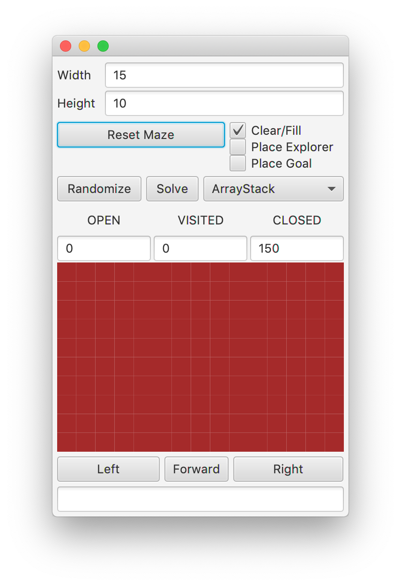

## Overview

In this lab, we will implement generic version of the Queue
data type within the context of searching a maze.

## Materials

-   IntelliJ
-   Lab partner

## Setup

1.  Download the [skeleton](../code/maze151dfs.zip) for this project.
2.  Unpack the code into a new IntelliJ Java project.

## Description

In this lab, we will explore searching a maze for a goal using a stack to
organize our potential Trails. The stack allows us to search in a
depth-first search manner. In other words, we can explore down a trail
as far as possible, and backtrack if we reached a dead end in our
journey, because we search the youngest potential trail next.

In this lab, you will create the necessary data structures to search a
maze in this depth-first search manner.

To start, run the code in MazeApp. After you click on "Randomize", you
should see the GUI layout here.

There are a few new pieces to this GUI. First, you will see a
choice for either ArrayStack or ListStack.
You will find the starter code for these included in the
`maze.searchers` directory.

Second, you will notice that there are statistics in the middle portion
of the GUI, recording the number of OPEN, CLOSED, and VISITED squares.

Third, there is a box at the bottom, to report errors when
things go wrong with the underlying implementations. It will also report
the number of steps taken when a solution trail is found through
searching.

This project contains a working implementation of the Maze Lab and
Project, so you do not have to revise any of your earlier code to add
this functionality.

## Step 1 - ArrayStack\<E\>

Our first task is to implement a generic Stack class that can be used in many
pieces of the code, for generating and then solving mazes.

## Step 2 - ListStack\<E\>

To implement the generic version of a Stack with nodes, your
first task is to implement the generic Node class. All of your
implementations for this lab will be located in the `maze.searchers`
directory.

### Step 2.1 - Implementation

You will first need to create a file called `ListNode.java` that
implements the Node class we discussed. It should have an `E value`, and
a `ListNode next` reference as components, along with get and set
methods for the value and next fields.

While the name of the file is `ListNode.java`, the name of your class
should be `ListNode<E>`.

### Step 2.2 - Implementation

Write a class called `ListStack<E>`. This will need to implement the
`Stack<E>` interface, and have at least a `ListNode<E>` called top as a
field.

Note that there is an additional method to implement. For ListNode
implementations, the `capacity` method should return the size.

### Step 2.3 - Testing

Run the `ListStackTest` suite, and ensure your above methods are passing
these tests.

### Step 3 - Creating Random Mazes

Uncomment code labeled for this portion in

-   MazeController

First, you will be creating random mazes by implementing the
tunnelRandomly function. You will use the randomDirections method of
Direction.

#### `public void tunnelRandomly()`

Create an `ArrayStack` of `Positions`, and push (0,0) onto the stack.

While the stack still has Positions:

-   Pop the top `Position` from the stack.
-   If this `Position` is in the maze, is filled, and has no more than one open neighbor,
    -   Clear this `Position`
    -   Add the neighbors to the stack in a **random** order.

### Step 4 - Solving Mazes

Uncomment code labeled for this portion in

-   Trail
-   PuzzleTest
-   MazeController

Finally, you will write an algorithm to solve a maze with the solve
method.

#### `public Trail solve()`

If there is no `Explorer` in the maze or no goal in the maze, then return
`null`.

Push the `Trail` starting at the `Explorer`'s
position onto the `solver` stack.

While the stack still has potential `Trails`, and you have not reached the
goal:

-   Pop the top `Trail` from the stack.
-   If the `Trail` end is the goal `Position`, return this `Trail`
-   If the `Cell` in the `Maze` at the `Trail` end is `OPEN`
    -   Mark it as a `VISITED` `Cell`
    -   Add new `Trails` based on this `Trail` for each of the neighbors to
        the stack.

If you empty the stack and have still not found the goal, then return `null`.

## What to Hand In

Submit your Maze.java, Puzzle.java, ArrayStack.java, ListNode.java, and
ListStack.java
implementations, along with any additional files you created for your
implementations.

## Grading

* To earn a 8, complete Step 1
* To earn a 13, do the above and Step 2
* To earn a 16, do the above and Step 3
* To earn a 20, do the above and Step 4

  Cumulative Progress                                                              Points Earned
  -------------------------------------------------------------------------------- ---------------
  Step 1                                                                           8
  Step 2                                                                           10
  Step 3                                                                           13
  Step 4                                                                           15
  Step 5                                                                           17
  Step 6                                                                           19
  Finish all six steps and submit a screenshot of a 20x20 maze you have created.   20
