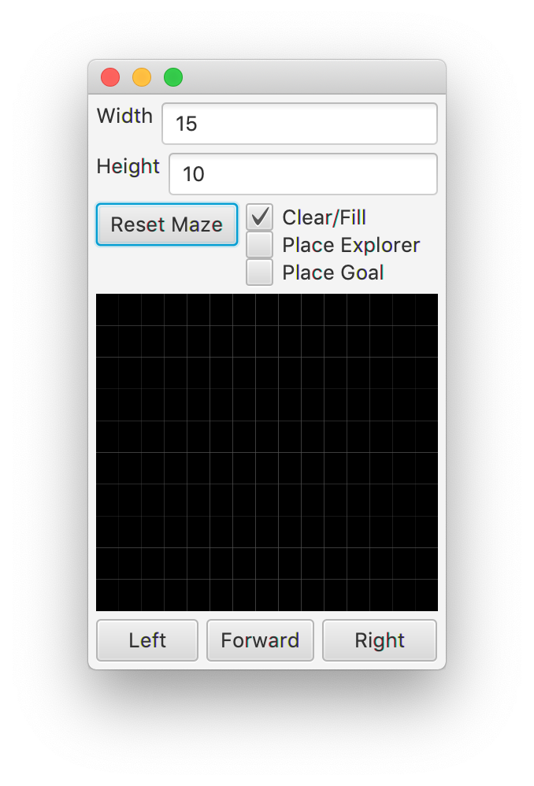
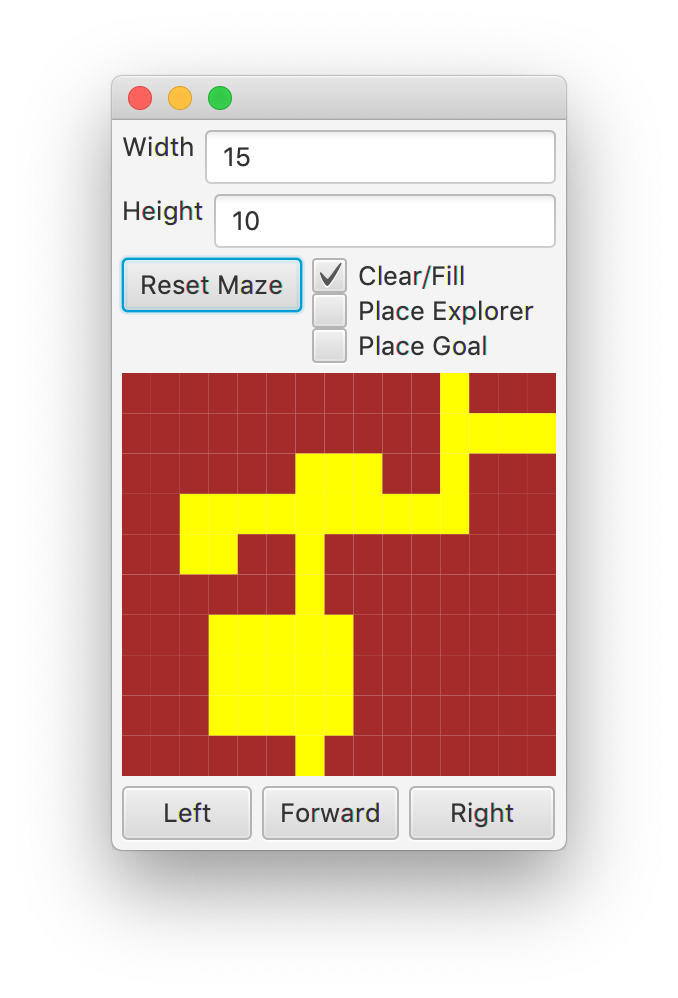
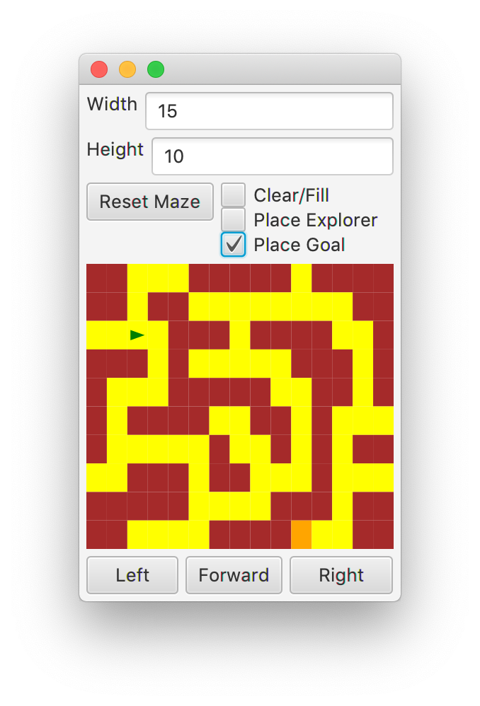

## Overview

In this lab, we will write classes encapsulating a 2D array, write
Enums, and test them with JUnit.

## Materials

-   IntelliJ
-   JavaFX
-   Lab partner

## Setup

1.  Download the [skeleton](../code/maze151.zip) for this project.
2.  Unpack the code into a new IntelliJ Java project.
3.  Also download [JavaFX](https://gluonhq.com/products/javafx).
4.  To set up JavaFX:
    -   Select Project Structure from the File menu.
    -   Select Global Libraries.
    -   Press the + sign to add a library. (Select "Java".)
    -   Go to the "lib" directory within JavaFX.
    -   Select all of the \*.jar files within that directory. Click OK.
    -   Rename the library **javafx17** instead of javafx-sdk. Then Click
        Apply and OK.
5.  To set up JUnit:
    -   Select Project Structure from the File menu.
    -   Select Libraries
    -   Press the + sign to add a library. (Select "Maven".)
    -   Type "junit" and click the magnifying glass to Search
    -   Scroll in the dropdown to find "junit:junit:4.13"
    -   Click OK
    -   Click OK on the popup window to Add this to the selected module.
    -   Click OK to close Project Structure.
6. Try running MazeApp. If a small window appears, everything
        works!

## Description

The puzzles inherent in [generating a
maze](https://en.wikipedia.org/wiki/Maze_generation_algorithm) and
[solving a maze](https://en.wikipedia.org/wiki/Maze_solving_algorithm)
lie at the heart of some very interesting
[problems](https://en.wikipedia.org/wiki/Category:Search_algorithms) in
computer science. Most obvious might be using Google Maps to find
directions from one location to another.

In this lab, you will create the necessary data structures to represent
a maze computationally, allowing a user to wander through the maze
toward a goal. In later labs, we will implement algorithms to generate and solve
mazes.

To start, run the code in MazeApp. After you click on "Reset Maze", you
should see the GUI layout here.

{: .img-fluid}

The Clear/Fill selection allows a user to manually create a maze on the
screen. This will be completed by you in steps 1 and 2 of this lab, and
augmented in step 3. The Place Explorer and Place Goal selections will
be implemented in step 4, which will also incorporate the movement
buttons Left, Forward and Right, found on the bottom of the screen.

There are two important elements already present in the code for this
project

#### Cell

This enum records the state of a `Cell` in the `Maze`. A cell can be `OPEN`,
`CLOSED`, or `VISITED`. Each cell knows its color, what state of the cell
should occur when the cell is flipped, and if it can be entered by an
`Explorer`.

#### Position

This class keeps track of an x and y coordinate. It has an accessor
method for each of these two variables, and can determine if it is
adjacent or equal to another `Position`.

## Step 1 - Maze

The core storage of the pathways and walls in the maze is in the `Maze`
class. It holds a 2D array of `Cells` as the only field.

### Step 1.1 - Implementation

You will need to write code for the following methods.

* `public Maze(int width, int height)`

  This constructor brings in a width and height, and initializes the 2D array to be of this size.
  Also, you need to set each individual `Cell` to be `CLOSED`.

* `public int getWidth()`

  Returns the width of the grid of `Cells`.

* `public int getHeight()`

  Returns the height of the grid of `Cells`.

* `public boolean inMaze(Position p)`

  A method to determine if a `Position` within the bounds of the grid of `Cells`.

* `public Cell getStateFor(Position p)`

  If the requested `Position` is in the maze, this method will return the corresponding `Cell`. Otherwise, it will always return the `CLOSED` `Cell`.

* `public void setStateFor(Position p, Cell state)`

  If the given `Position` is in the maze, this method will set the corresponding grid location to the given `Cell`.

### Step 1.2 - Testing

Run the `MazeTest` suite, and ensure your above methods are passing
these tests.

## Step 2 - Puzzle

The `Puzzle` class is our central model for this program. It will hold a
`Maze`, an `Explorer`, and a `Position` to represent the `goal` in our maze.
In this step, you will complete the code for interacting with the `Maze`.

### Step 2.1 - Implementation

You will need to write code for the following methods.

* `public Puzzle(int width, int height)`

  The constructor should make a `Maze` of the specified width and height. It should leave the `Explorer` and `goal` null.

* `public int getWidth()`

  Returns the width of the maze.

* `public int getHeight()`

  Returns the height of the maze.

* `public Color getColorFor(Position p)`

  Returns the color of the `Cell` at the requested `Position` in the maze.

* `public boolean canEnter(Position p)`

  Determines if the `Cell` at the `Position` given in the maze can be entered, i.e. is it an `OPEN` pathway.

* `public void fill(Position p)`

  Sets the `Cell` in the maze at the given `Position` to be `CLOSED` up as a wall.

* `public boolean clear(Position p)`

  Sets the `Cell` in the maze at the given `Position` to be `OPEN` for a pathway. This will return `true` if it was successful, and `false` otherwise. Positions outside the `Maze` can never be cleared.

### Step 2.2 - Testing

Run the `PuzzleTest` suite, and ensure your above methods are passing
these tests.

### Step 2.3 - GUI

Now, run the `MazeApp` class, and test out your code with the GUI.

Click <kbd>Reset Maze</kbd> to see a maze with all closed (red) `Cells`.
Now, you should be able to click on squares to open and close pathways in the
maze.

{: .img-fluid}

## Step 3 - Avoiding Rooms

We can add a restriction on the ability of the user to create mazes with
large rooms. A room is defined as any four OPEN `Cells` that form a 2x2
square.

### Step 3.1 - Direction

You will add the implementations for the `getClockwise`,
`getCounterClockwise` and `getRotation` methods of the `Direction` enum.
Use the standard compass rose to map each `Direction` to its clockwise and
counterclockwise neighbor. For the rotation, you should return the angle
in degrees for each orientation, where SOUTH is at 0 degrees, WEST is
90, NORTH is 180, and EAST is -90.

### Step 3.2 - Direction Testing

Verify that your `Direction` is working with the `DirectionTest` suite.

### Step 3.3 - Maze Updates

In the `Maze` class, implement the following method:

* `public boolean inRoom(Position p)`.

  This method will return `true` if the requested `Position` is part of a room, as defined above.



### Step 3.4 - Testing

Uncomment code labeled for this step in

-   `MazeTest`

Test out your code with the `MazeTest` suite.

### Step 3.5 - Puzzle Updates

You will need to update your `clear` method of the `Puzzle`. It should now
be the case that the only `Cell`s that can be cleared are those in the
`Maze` that will not cause a room to be formed.

### Step 3.6 - Testing

Uncomment code labeled for this step in

-   `PuzzleTest`

Test out your code with the `PuzzleTest` suite.

### Step 3.7 - GUI

Run the GUI to interact with your code.

{: .img-fluid}

## Step 4 - Explorer and Goal

The `Explorer` code is completed for you, and an `Explorer` can move around
the maze and look ahead according to their internal `Position` and
`Direction`. There are three pieces of code we will need to complete for
the `Explorer` and goal portions of the `Puzzle` class.

### Step 4.1 - Move

In the `Move` enum, you will need to create three elements, `FORWARD`, `LEFT`
and `RIGHT`.

Add two abstract methods for `newPosition` and `newDirection`
as shown below, and then provide an implementation for each of the three
directions.

* `public abstract Position newPosition(Position p, Direction d)`

  Given a `Position` and a `Direction`, return the new `Position` found by going in the `Direction`. When going `FORWARD`, this should make use of the `getNeighbor` method found in `Direction`, otherwise the `Position` should remain the same.

* `public abstract Direction newDirection(Direction d)`

  Given a `Direction`, return a new `Direction`. `LEFT` should rotate counterclockwise, while `RIGHT` rotates clockwise, and `FORWARD` does not change the direction.

### Step 4.2 - Move Testing

Uncomment code labeled for this step in

-   `MoveTest`

Verify that your `Move` is working with the `MoveTest` suite.

### Step 4.3 - Puzzle Explorer

More methods are now required in the `Puzzle` class. Complete the
implementation of the following methods.

* `public boolean hasExplorer()`

  Returns `false` if the `hero` is `null`, otherwise returns `true`.

* `public void placeExplorer(Position p)`

  Creates a new `Explorer` at the given `Position` and saves it in the `hero` field.

* `public void moveExplorer(Move m)`

  Calls the `move` method on the `hero` if the `Puzzle` has an `Explorer`.

* `public Position getExplorerPosition()`

  Returns the `Position` of the `Explorer`.

* `public Direction getExplorerHeading()`

  Returns the `Direction` of the `Explorer`.

### Step 4.4 - Puzzle Goal

Finally, add two more methods to `Puzzle` to allow for a goal `Position` to
be placed in the `Puzzle`.

* `public void placeGoal(Position p)`

  Saves the given `Position` as the `goal` position.

* `public Position getGoal()`

  Returns the `goal` position.

### Step 4.5 - Explorer and Puzzle Testing

Uncomment code labeled for this step in

-   `Explorer`
-   `PuzzleTest`

Verify that your Puzzle and Explorer are working with the `PuzzleTest` suite.

### Step 4.6 - GUI

Uncomment code labeled for this step in

-   `MazeController`

Run the GUI to interact with your code.

{: .img-fluid}

## What to Hand In

Submit your `Maze.java`, `Puzzle.java`, `Direction.java` and `Move.java`
implementations via Teams, along with any additional files you created for your implementations.

## Grading

* To earn a 5, complete Step 1
* To earn a 10, do the above and Step 2
* To earn a 15, do the above and Step 3
* To earn a 20, do the above and Step 4
