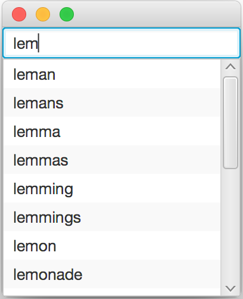

## Overview

In this lab, we will implement a *trie* for storing strings and use it
to predict words as they are being typed.

## Setup

-   Download the [skeleton](../code/triepredict.zip) for this project.

## Description

Modern smartphones include keyboard assistants that will suggest words
while you are typing. There are many data structures that can be used to
assist in this interaction, to predict the remainder of words, and
autocorrect typed words. One such data structure is a *trie*, which
divides the words into their component characters, and then stores the
words in such a way that words with a shared prefix share a part of the
tree.

There are two main components to the model found in the skeleton
project: a `Trie` to store the tree of strings, and a `SortedArrayMap`
to map characters to child `Trie`s. `SortedArrayMap` in turn is
implemented in terms of a `SortedArray` class.

You will only have to write code in the `Trie` class, but you will need
to also look at the other classes to see what methods are available.
Methods that remain to be implemented in the `Trie` class have been
marked with `TODO` for easy identification.

## Step 1: size

Implement the `size` method. It should essentially count how many `Trie`
nodes have `isMember` set to `true`. This can be done recursively:

-   If `isMember` is `true`, count 1.
-   Add up the result of calling `size` recursively on all children.

To iterate over all children, you can use a foreach loop, which depends
on the `iterator()` method from `SortedArrayMap`.

## Step 2: getChildWith and find

Implement `getChildWith` and `find`.

-   `getChildWith` is *not* recursive. It just gets the child
    corresponding to a given letter one level down, or returns
    `Optional.empty()` if no child corresponds to that letter. This
    method is just for convenience when implementing the `find` method.

-   `find` is another helper method you may find useful later. It
    follows an entire `String` through the trie, taking one step down
    per character. It returns a stack of `Trie` nodes that trace the
    path that corresponds to the prefix. If the prefix is not present,
    the stack will contain all of the leading characters from the prefix
    that are present. The stack is implemented using an object of the
    [`ArrayDeque`](https://docs.oracle.com/javase/9/docs/api/java/util/ArrayDeque.html)
    class. It does not matter whether `isMember` is set or not.

## Step 3: contains, add, remove

The implementations of all three of these methods will be *much* simpler
if `find` is employed as a helper method.

-   Implement `contains`, which tests whether a given string is
    contained in the trie (note "contained" means "`isMember` is set").

-   Implement `add`, which adds a new word to the trie.

-   Implement a simple version of `remove`, which simply finds the end
    of the word to remove and then sets `isMember` to `false`. This will
    pass all the tests but leaves lots of useless `Trie` nodes lying
    around; see Step 5.

## Step 4: inorder, successorsTo

Implement `inorder` and `successorsTo`. See the comments in the code for
descriptions of what they should do. Coming up with a good way to
organize `inorder` is tricky. Feel free to ask me for hints. Once you
have written `inorder`, it should be possible to write `successorsTo` in
a concise way that reuses several previous pieces.

## Step 5: better remove

Implement a better version of `remove`, which actually deletes any
unneeded `Trie` nodes. The stack of nodes returned by `find` may be
helpful in this task.

## Grading

* To earn a 5, complete Step 1
* To earn a 10, do the above and Step 2
* To earn a 15, do the above and Step 3
* To earn a 20, do the above and Step 4
* To earn a 25, do the above and Step 5
