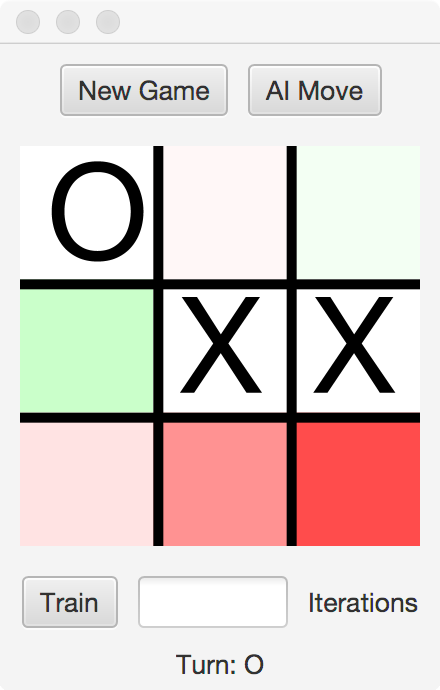

## Overview

In this lab, we will implement a HashTable for use in a learning
algorithm for Tic-Tac-Toe.

## Materials

-   IntelliJ
-   Lab partner

## Setup

1.  Download the [skeleton](../code/151hashtictactoe.zip) for this project.
2.  Unpack the code into a new IntelliJ Java project.

## Description

HashTables are an efficient implementation of the
[Map](https://docs.oracle.com/javase/8/docs/api/java/util/Map.html)
interface, with the ability to lookup items in constant time on average.
For this lab, we will be implementing a `HashTable` to be used in the
context of an Artificial Intelligence game player.

In particular, we will be learning how to play the game Tic-Tac-Toe. After
a game is played, each board state along the path from the initial board
to the final board will be recorded as a win for the winning player. If
the board state has never been encountered before, then a new entry is
created in a `HashTable` with equal win/loss/draw counts, and then updated
based on this play. Later board states will be influenced more than
earlier board states, to account for the recency of the position and
opportunity for alternate play choices.

As more games are recorded, the AI will build up a probabilistic picture
of the game tree. The user can elect to train multiple iterations at
once with the <kbd>Train</kbd> button, which will play random games of the computer
vs itself. Using the learned knowledge, the <kbd>AI Move</kbd> button will select
the move that has shown the highest probability of success.

Besides the `HashTable` to store board states, another `HashTable` is used
to record a GUI `Rectangle` for each position on the board. To guide the
player, those moves more likely than average to succeed will be shaded
green, while those less likely to succeed will be shaded red.

In your code below, you should follow good coding practices, for
example, noticing when you are writing essentially the same code twice
and abstracting this pattern into a private method.

## Step 1 - index

The first method we must implement for the `HashTable` is the `index`
method. When passed a key, it will return the appropriate HashTable
index for that key using the `hashcode()` of the key modded by the length
of the array, **then taking the absolute value**.

A successful solution
for this step will pass the `testIndex` test case.

## Step 2 - put

The second method we must implement for the `HashTable` is the `put` method.
When passed a key-value pair, first, the associated index into the
allocated array must be found using the `index` method from Step 1.

If there is no entry at the found location, a new `HashNode` is created to
store the key and value. However, if there already exists a `HashNode` at
that location, we first check to see if the keys match. If a match is
found, the new value replaces the old value for that node. If the keys
do not match, then a collision has occurred and must be resolved.

To resolve the collision, use the separate chaining algorithm to walk
the linked list of `HashNodes` at that location, looking for either a
matching key or the end of the chain. If the end of the chain is
reached without find a match for the key, add a new `HashNode`
at the beginning of the list, using the current array entry as the `next`
in the constructor.

Only when a new `HashNode` is created should the size counter be
incremented.

## Step 3 - get

This method finds the associated index into the allocated array using
the `index` method from Step 1. Then, following the separate chaining collision
resolution method described above, we walk through the `HashNodes` found,
until either a matching key is identified and the method returns the
value of this node, or we encounter a `null` position and the method
returns `Optional.empty()`.

A successful solution for Steps 2 and 3 will pass `testPutGet`,
`testDuplicate`, and `testVeryBad`.

## Step 4 - allKeys

While the keys cannot be returned in order using a `HashTable`, it is
feasible to loop through the array and collect all the keys in this
unordered fashion. Note that you must collect all the keys in the linked
list, not just the key of the first element. Store each key when found
in an `ArrayList`, and return this list.

A successful solution will pass `testKeys`.

## Step 5 - resizing

As we add more items to our Map, the efficiency will degrade. We need to revise
the `put` method to account for this.

When the load factor of the `HashTable`, determined by the size of the
`HashTable` divided by the capacity of the array, exceeds 0.75, the `put`
method should double the side of the array.

Once the array is doubled, 'reput' all the entries into the new array
(you will need to `index()` them again since the length of
the array has changed).

A successful solution will pass `testCapacityIncrease`.

## Step 6 - Playing Tic-Tac-Toe

Once your implementation passes the unit tests, you are ready to play
Tic-Tac-Toe. Record the following in a Evaluation Document.
*  Experimentally determine the number of training iterations
necessary for the AI to never be defeated when you play against it.
*  Discuss the strategy you attempted to use to defeat the AI.
*  Characterize the strategy the AI manifests.

## What to Hand In

Submit your `HashTable.java` implementation on Moodle, along with your
Evaluation Document.

## Grading

* To earn a 6, complete Step 1
* To earn a 12, do the above and Step 2 & 3
* To earn a 15, do the above and Step 4
* To earn a 17, do the above and Step 5
* To earn a 20, do the above and Step 6
